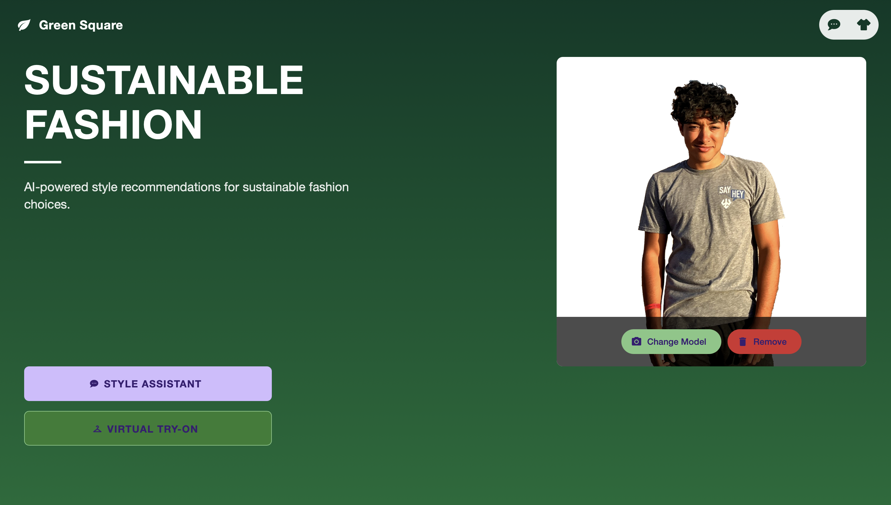
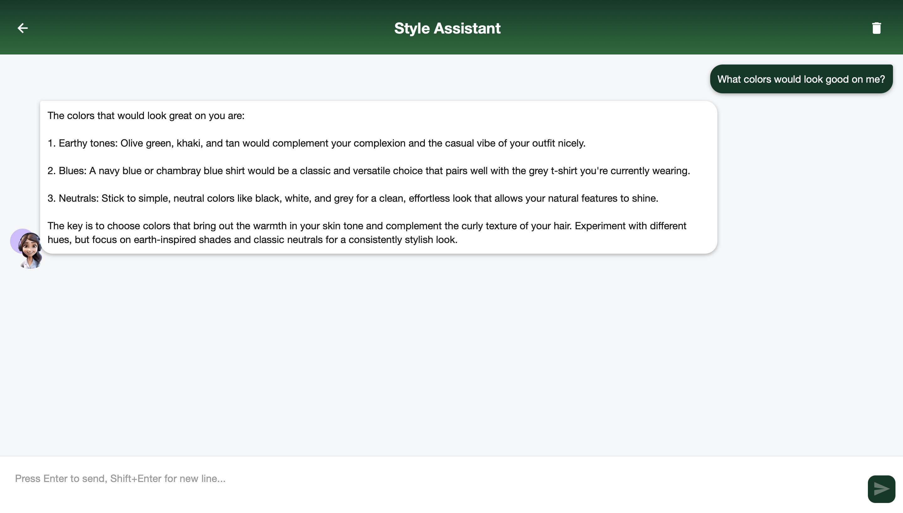

# Sustainable Fashion AI

An AI-powered fashion recommendation platform that helps users make sustainable fashion choices through personalized styling and virtual try-on capabilities.

<div style="display: flex; gap: 20px; margin: 30px 0;">
    
    
    
</div>

## 🏆 Recognition

Green Square was awarded a $1,000 prize at the inaugural [SOLVE 2024 Hackathon at Washington and Lee University](https://columns.wlu.edu/wl-holds-inaugural-solve-2024-hackathon-event-on-campus/). The project was recognized for its innovative approach to sustainable fashion, utilizing AI technology to help users visualize and make eco-conscious clothing choices through a virtual "try it on" approach.

## 🌟 Features

- **Style Assistant**: Get personalized fashion recommendations based on your preferences while prioritizing sustainable options
- **Virtual Try-On**: Visualize how different pieces would look on you using advanced AI technology
- **AI-Powered Recommendations**: Advanced algorithms powered by Claude AI that consider both style preferences and sustainability metrics
- **Digital Wardrobe**: Manage your clothing collection and experiment with different combinations

## Tech Stack

- React Native + Expo
- AsyncStorage for local data persistence
- Flask
- Claude AI (Anthropic)
- PIL for image processing
- OOTDiffusion for virtual try-on

## Quick Start

1. **Clone the repository**
   ```bash
   git clone https://github.com/FekryMostafa/Green-Square
   cd Green-square
   ```

2. **Set up the backend**
   ```bash
   # Navigate to backend directory
   cd backend
   
   # Install Python dependencies
   pip install -r requirements.txt
   
   # Create .env file and add your API key
   echo "ANTHROPIC_API_KEY=your_api_key_here" > .env
   
   # Start the Flask server
   python app.py
   ```
   Server will run on http://localhost:5001

3. **Set up the frontend**
   ```bash
   # In a new terminal, navigate to frontend directory
   cd frontend
   
   # Install dependencies
   npm install
   
   # Update config.js with your local IP
   # Then start the Expo server
   npm start
   ```
   The web version will be available at http://localhost:19006

## Development Setup

1. **Configure your environment**:
   ```bash
   # backend/.env
   ANTHROPIC_API_KEY=your_anthropic_api_key_here
   FLASK_SECRET_KEY=your_secret_key_here
   ```

2. **Find your local IP address**:
   - Windows: `ipconfig`
   - Mac/Linux: `ifconfig`
   - Update `frontend/config.js` with your IP address

3. **Run in development mode**:
   ```bash
   # Terminal 1 - Backend
   cd backend
   python app.py

   # Terminal 2 - Frontend
   cd frontend
   npm start
   ```

## Troubleshooting

- If you see CORS errors, ensure your IP is correctly set in `frontend/config.js`
- If the API calls fail, check that your Anthropic API key is correctly set in `.env`
- Make sure both backend and frontend servers are running simultaneously
